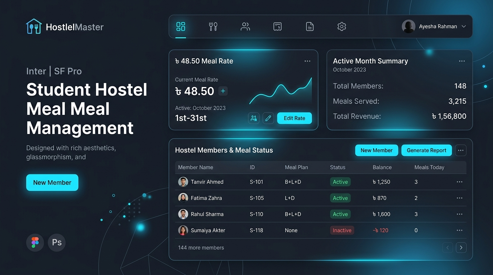

# HostelMaster — Student Hostel & Mess Management System

[](https://student-hostel-meal-managenment-system.vercel.app/)
[-black?style=for-the-badge&logo=nextdotjs)](https://nextjs.org/)
[](https://tailwindcss.com/)
[](https://firebase.google.com/)

HostelMaster is a full-featured, multi-tenant SaaS application designed to digitize student hostels, shared mess halls, and bachelor co-living residences. It eliminates messy paper logs, inaccurate spreadsheets, and payment disputes by automating meal calculations, expense distributions, and grocery schedules.



---

## 🔗 Live Application URL
Access the live production system here:  
👉 **[https://student-hostel-meal-managenment-system.vercel.app/](https://student-hostel-meal-managenment-system.vercel.app/)**

---

## 🎯 Key Benefits

*   **100% Accounting Transparency:** Mathematical formulas prevent arbitrary bookkeeping. Every transaction, bazaar receipt, and meal booking is visible to all members.
*   **Time & Labor Savings:** Managers save hours of manual logging. The system automatically computes dynamic meal rates and splits utility expenses instantly.
*   **Zero Human-Error Audits:** Instant calculations prevent arithmetic slips in split bills, deposit aggregations, or credit/debit balances.
*   **Cross-Language & Mobile Friendly:** Fully responsive mobile first UI natively translated into **English**, **বাংলা (Bangla)**, and **हिंदी (Hindi)**.

---

## 🛠️ System Features

### 🍱 1. Real-Time Meal Management
*   **Meal Bookings:** Book individual breakfast, lunch, and dinner tallies.
*   **Guest Meal Tracking:** Add guest meal counts to individual members dynamically.
*   **Dynamic Meal Rate:** The system continuously recalculates the current meal rate using the formula:
    $$\text{Meal Rate} = \frac{\text{Total Bazaar Expenses}}{\text{Total Meals Consumed}}$$

### 💸 2. Financial Ledger & Split Billing
*   **Double-Entry Transparency:** Full log of deposits, debits, and net balances for every hostel resident.
*   **Dual-Category Expense Management:**
    1.  *Bazaar Expenses:* Divided proportionally among members based on their actual meal counts.
    2.  *Shared Utility Costs:* General costs (e.g., house rent, cook salary, electricity, Wi-Fi) are split equally among all members.

### 🛒 3. Interactive Bazaar Scheduling
*   **Duty Assignments:** Assign weekly or daily shopping duties to members.
*   **Budgeting & Receipt Logs:** Allocated shopping budgets with real-time logging and expense descriptions.

### 👥 4. Role-Based Permissions
*   **Manager (Admin):** Can directly add/update meals, log raw expenses, approve deposit requests, onboarding new members, change settings, and publish Notices.
*   **Member:** Can request meal changes, log their bazaar shopping lists, submit payment deposits, and view full stats.

### 💬 5. Communication Hubs
*   **Group Chat & Direct Messaging:** Built-in floating chat widget supporting real-time group and direct channels.
*   **Smart Push Notifications:** In-app triggers for new notices, pending requests, and manager approvals.

---

## 🏢 Target Use Cases

1.  **University Student Dorms / Messes:** Perfect for roommates running shared kitchens.
2.  **Bachelor & Working-Professional Messes:** Simplifies splitting rent, utility bills, and food budgets.
3.  **Hostel Wardens & Managers:** Provides managers a centralized dashboard to track cash flow, manage rosters, and issue formal notices.

---

## 📖 User Manual & Workflow Guide

### 🚀 Getting Started & Onboarding

#### A. Creating a New Hostel (For Managers)
1.  Navigate to `/register` and create an account.
2.  On the onboarding screen, choose **"Create a New Hostel"**.
3.  Enter your hostel name, monthly currency (e.g., `৳` or `$`), and click Create.
4.  Copy your unique **Hostel Code** (e.g., `HST-X7K92`) from the dashboard top-bar and share it with your members.

#### B. Joining an Existing Hostel (For Members)
1.  Navigate to `/register` and create an account.
2.  Choose **"Join an Existing Hostel"** on the onboarding screen.
3.  Paste the **Hostel Code** shared by your manager and submit.
4.  Your status will remain `Pending` until the Manager approves your request.

---

### 💼 Manager Operations Guide

*   **Approving Members:** Open the **Manager Panel** or the **Members Tab**, view pending join requests, and click **Approve**.
*   **Recording Meals:** Directly edit member meal cards. Enter breakfast, lunch, and dinner counts for any day in the active billing month.
*   **Reviewing Deposits:** When a member submits a deposit request, review their details (amount, payment method, transaction ID). Click **Approve** to add it to their ledger.
*   **Posting Announcements:** Write notifications on the **Notice Board** to announce urgent meetings, payment deadlines, or bazaar schedule adjustments.

---

### 👤 Member Operations Guide

*   **Requesting Meal Bookings:** If you need to change your meals for the day or upcoming dates, click **Add Meal Request** on the dashboard, fill in the values, and submit for manager approval.
*   **Submitting Deposit Proof:** When you pay your monthly deposit (via cash, bKash, Nagad, etc.), submit a deposit request. Input the exact amount, select payment method, and paste the transaction ID.
*   **Logging Bazaar Expenses:** If it's your bazaar duty day, buy groceries, and log the total amount with description details to add it to the hostel's bazaar ledger.

---

## 💻 Tech Stack

*   **Frontend Framework:** Next.js 16 (App Router), React 19
*   **Styling & Motion:** Tailwind CSS v4, Framer Motion
*   **Backend & DB:** Firebase Client SDK (Auth, Cloud Firestore)
*   **Forms & Validation:** React Hook Form, Zod
*   **Visualization:** Recharts (Analytics and cash graphs)
*   **UI Extras:** Lucide Icons, Sonner (Toast alerts)

---

## ⚙️ Installation & Local Setup

To run this project locally, follow these steps:

### 1. Prerequisite
Ensure you have **Node.js 18.x** or higher installed.

### 2. Clone the Repository
```bash
git clone https://github.com/PriyoGhosh02/StudenHostel_Meal_Managenment.git
cd StudenHostel_Meal_Managenment
```

### 3. Install Dependencies
```bash
npm install
```

### 4. Setup Environment Variables
Create a `.env.local` file in the root directory and copy the variables from `.env.example`:
```bash
cp .env.example .env.local
```
Fill in your Firebase web app keys from the **Firebase Console**:
```env
NEXT_PUBLIC_FIREBASE_API_KEY=your-api-key-here
NEXT_PUBLIC_FIREBASE_AUTH_DOMAIN=your-project-id.firebaseapp.com
NEXT_PUBLIC_FIREBASE_PROJECT_ID=your-project-id
NEXT_PUBLIC_FIREBASE_STORAGE_BUCKET=your-project-id.appspot.com
NEXT_PUBLIC_FIREBASE_MESSAGING_SENDER_ID=your-messaging-sender-id
NEXT_PUBLIC_FIREBASE_APP_ID=your-app-id
```

### 5. Run the Local Development Server
```bash
npm run dev
```
Open **[http://localhost:3000](http://localhost:3000)** in your browser to view the application.

---

## 📄 License
This project is private and proprietary. All rights reserved.
